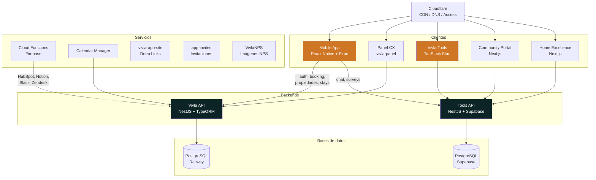

## Ecosistema VIVLA

VIVLA opera sobre dos backends independientes que sirven a distintos clientes. Todos los frontends pasan por Cloudflare para DNS, CDN y control de acceso.

<Note>
  La **Mobile App** consume **dos backends**: la API principal (vivla-api) para booking, propiedades, auth y stays; y la **Tools API** (vivla-tools) para chat y encuestas.
</Note>

## Dos backends, dos mundos

| | Vivla API | Tools API |
|---|---|---|
| **Repo** | `vivla-api` | `vivla-tools` (monorepo) |
| **Framework** | NestJS 11 | NestJS 10 |
| **Base de datos** | PostgreSQL (Railway) via TypeORM | PostgreSQL (Supabase) directo |
| **Auth** | JWT propio | Auth0 + API key guard |
| **Clientes** | Mobile App, Panel, Calendar Manager | Mobile App (chat/surveys), Tools Frontend, Community Portal, Home Excellence |
| **Hosting** | Railway | Railway |

## Stack tecnológico completo

| Producto | Tecnología | Hosting |
|----------|-----------|---------|
| **Vivla API** | NestJS 11, PostgreSQL (TypeORM), Firebase, GCS | Railway |
| **Vivla Tools** | TanStack Start + NestJS + Supabase, Stream Chat, Auth0 | Railway |
| **Mobile App** | React Native 0.79, Expo SDK 53, TypeScript 5.8 | App Store / Google Play |
| **Panel CX** | vivla-panel (TBD) | TBD |
| **Community Portal** | Next.js 14 (portal público clientes) | Railway |
| **Home Excellence** | Next.js 14 (portal público propietarios) | Railway |
| **Cloud Functions** | Firebase Functions, Node.js 20 | Google Firebase |
| **Deep Links** | Cloudflare Pages (vivla-app-site) | Cloudflare Pages |
| **Invitaciones** | Vercel Functions (app-invites) | Vercel |
| **NPS** | React 19, Vite, MUI, Firebase | TBD |
| **DNS / CDN** | Cloudflare (Access para wiki y tools) | — |
| **Docs** | Mintlify | Mintlify Cloud |

## Conexiones clave

<CardGroup cols={2}>
  <Card title="Mobile App → 2 backends" icon="mobile">
    La app consume **vivla-api** para auth, booking, propiedades, stays e invitaciones. Usa **Tools API** para chat en tiempo real y encuestas.
  </Card>
  <Card title="Panel → Vivla API" icon="headset">
    El backoffice de CX consume exclusivamente la API principal para gestionar reservas y atender clientes.
  </Card>
  <Card title="Cloud Functions → Integraciones" icon="cloud">
    Firebase Functions orquestan: HubSpot (CRM), Notion, Slack (alertas), Zendesk (soporte), reportes y NPS.
  </Card>
  <Card title="Portales públicos → Tools API" icon="globe">
    Community Portal (guías de propiedades) y Home Excellence (métricas para propietarios) son Next.js apps que consumen la Tools API.
  </Card>
</CardGroup>

Ver [Repositorios](/repositories) para la descripción detallada de cada repo.
