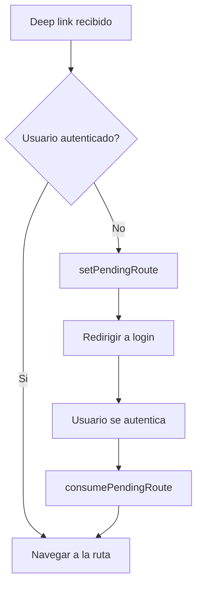

# Deep Linking

La app de Vivla soporta deep links para permitir la navegacion directa a pantallas especificas desde URLs externas, notificaciones push y otras aplicaciones.

## Esquemas de URL por entorno

Cada entorno tiene su propio esquema de URL para evitar conflictos entre versiones instaladas simultaneamente:

| Entorno     | Esquema                                    |
| ----------- | ------------------------------------------ |
| Production  | `vivla://`                                 |
| Beta        | `vivlabeta://`                             |
| Development | `vivladev://`                              |
| Web         | `https://vivla.app`, `https://*.vivla.app` |

## Universal Links / App Links

<Tabs>
  <Tab title="iOS — Associated Domains">
    La app configura Associated Domains para manejar Universal Links:

    - `applinks:vivla.app`
    - `applinks:*.vivla.app`

    Esto permite que enlaces web abran directamente la app cuando esta instalada.

  </Tab>
  <Tab title="Android — Intent Filters">
    En Android se configuran Intent Filters con `autoVerify` para los siguientes dominios:

    - `https://vivla.app`
    - `https://*.vivla.app`

    El sistema Android verifica automaticamente la asociacion entre la app y los dominios.

  </Tab>
</Tabs>

## Servicio de linking

El archivo `src/shared/services/linkingService.ts` es el punto central para el manejo de URLs entrantes, tanto desde deep links como desde notificaciones push.

### Rutas soportadas

| Ruta                              | Pantalla                   | Descripcion                                 |
| --------------------------------- | -------------------------- | ------------------------------------------- |
| `/booking/[id]`                   | Detalle de reserva         | Navega al detalle de una reserva especifica |
| `/property/[id]`                  | Detalle de propiedad       | Navega al detalle de una propiedad          |
| `/chat/[channelType]/[channelId]` | Conversacion               | Abre una conversacion de chat especifica    |
| `/invite/[token]`                 | Aceptar invitacion         | Procesa una invitacion mediante token       |
| `/invite/owner/[bookingId]`       | Invitacion del propietario | Invitacion asociada a una reserva           |

## PendingDeepLinkStore

El store `src/shared/stores/pendingDeepLinkStore.ts` se encarga de preservar deep links cuando el usuario no esta autenticado.

### Metodos

| Metodo                  | Descripcion                                                  |
| ----------------------- | ------------------------------------------------------------ |
| `setPendingRoute()`     | Almacena la ruta pendiente para procesarla despues del login |
| `consumePendingRoute()` | Recupera y limpia la ruta pendiente                          |

### Flujo de deep link con autenticacion



<Note>
  Este mecanismo asegura que los deep links no se pierdan cuando la app requiere autenticacion. El
  usuario es redirigido a login y, una vez autenticado, se navega automaticamente a la ruta
  original.
</Note>

## Push notification deep links

Las notificaciones push pueden incluir un campo `deep_link` en su payload. Cuando el usuario interactua con la notificacion:

1. El `linkingService` recibe la notificacion
2. Extrae el campo `deep_link` del payload
3. Procesa la URL y navega a la ruta correspondiente
4. Si el usuario no esta autenticado, el deep link se almacena en `PendingDeepLinkStore`

<Warning>
  Asegurate de que las notificaciones push incluyan el campo `deep_link` con una ruta valida. Rutas
  invalidas seran ignoradas silenciosamente por el servicio de linking.
</Warning>

## Plugin withNavigationSchemes

El plugin personalizado `withNavigationSchemes` agrega esquemas de navegacion externa en iOS mediante `LSApplicationQueriesSchemes`. Esto permite que la app pueda abrir otras aplicaciones de mapas:

<CardGroup cols={3}>
  <Card title="Google Maps" icon="map">
    Esquema `comgooglemaps://`
  </Card>
  <Card title="Waze" icon="map-pin">
    Esquema `waze://`
  </Card>
  <Card title="Apple Maps" icon="apple">
    Esquema nativo de iOS
  </Card>
</CardGroup>

## Configuracion en app.config.ts

La configuracion de deep linking se define en `app.config.ts`:

```typescript
// Prefijos aceptados para deep linking
deepLinking: {
  prefixes: ['vivla://', 'vivlabeta://', 'vivladev://', 'https://vivla.app', 'https://*.vivla.app'];
}

// Type-safety en rutas
experiments: {
  typedRoutes: true;
}
```

<Note>
  Con `typedRoutes: true` habilitado, el compilador de TypeScript valida que las rutas de navegacion
  sean correctas en tiempo de compilacion, evitando errores por rutas inexistentes.
</Note>
