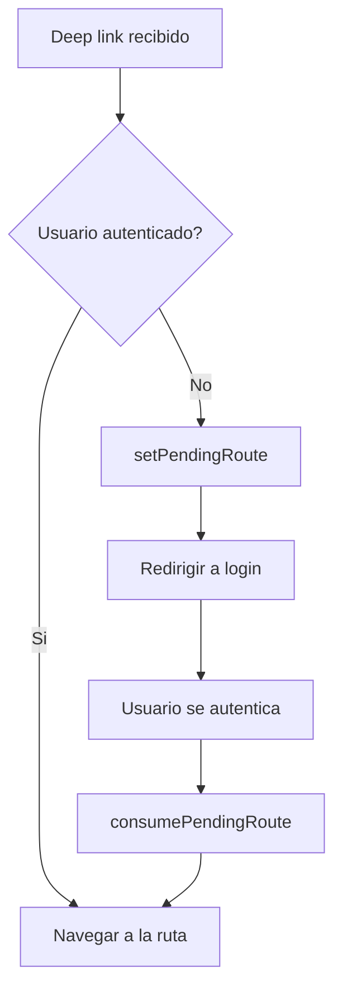

# Deep Linking

La app de Vivla soporta deep links para permitir la navegacion directa a pantallas especificas desde URLs externas, notificaciones push y otras aplicaciones.

## Esquemas de URL por entorno

Cada entorno tiene su propio esquema de URL para evitar conflictos entre versiones instaladas simultaneamente:

| Entorno     | Esquema                                    |
| ----------- | ------------------------------------------ |
| Production  | `vivla://`                                 |
| Beta        | `vivlabeta://`                             |
| Development | `vivladev://`                              |
| Web         | `https://vivla.app`, `https://*.vivla.app` |

## Universal Links / App Links

<Tabs>
  <Tab title="iOS — Associated Domains">
    La app configura Associated Domains para manejar Universal Links:

    - `applinks:vivla.app`
    - `applinks:*.vivla.app`

    Esto permite que enlaces web abran directamente la app cuando esta instalada.

  </Tab>
  <Tab title="Android — Intent Filters">
    En Android se configuran Intent Filters con `autoVerify` para los siguientes dominios:

    - `https://vivla.app`
    - `https://*.vivla.app`

    El sistema Android verifica automaticamente la asociacion entre la app y los dominios.

  </Tab>
</Tabs>

## Servicio de linking

El archivo `src/shared/services/linkingService.ts` es el punto central para el manejo de URLs entrantes, tanto desde deep links como desde notificaciones push.

### Rutas soportadas

| Ruta                              | Pantalla                   | Descripcion                                 |
| --------------------------------- | -------------------------- | ------------------------------------------- |
| `/booking/[id]`                   | Detalle de reserva         | Navega al detalle de una reserva especifica |
| `/booking/review`                 | Resena de estadia          | `bookingId` requerido. Usa SurveyScreen     |
| `/property/[id]`                  | Detalle de propiedad       | Navega al detalle de una propiedad          |
| `/property/home-review`           | Home review                | `propertyId` requerido. Usa SurveyScreen    |
| `/property/arrival-review`        | Arrival review             | `propertyId` y `bookingId` requeridos       |
| `/property/rating-report`         | Rating report              | `propertyId` requerido                      |
| `/survey`                         | Encuesta generica (modal)  | `slug` y `scopeId` requeridos               |
| `/survey/[slug]`                  | Encuesta por slug (modal)  | `propertyId` o `bookingId` requerido        |
| `/chat/[channelType]/[channelId]` | Conversacion               | Abre una conversacion de chat especifica    |
| `/invite/[token]`                 | Aceptar invitacion         | Procesa una invitacion mediante token       |
| `/invite/owner/[bookingId]`       | Invitacion del propietario | Invitacion asociada a una reserva           |

### Ruta generica de encuestas

La ruta `/survey` permite abrir cualquier encuesta como modal sin crear rutas especificas. Soporta dos formatos de deep link:

```
vivla://survey?slug=onboarding-review&propertyId=X
vivla://survey/financial-review?propertyId=X
vivla://survey?slug=arrival-review&bookingId=X&scopeType=booking
```

El servicio infiere automaticamente:

- `scopeId` de `queryParams.scopeId ?? queryParams.propertyId ?? queryParams.bookingId`
- `scopeType` de `queryParams.scopeType ?? (queryParams.bookingId ? 'booking' : 'property')`
- `entryPoint` default: `'deep_link'`

### Parametro entryPoint

Las rutas de encuesta aceptan un parametro opcional `entryPoint` que indica como se accedio a la encuesta. Se usa para analytics:

| Valor       | Descripcion                         |
| ----------- | ----------------------------------- |
| `home`      | Desde la card en la home screen     |
| `deep_link` | Via deep link externo (default)     |
| `auto_show` | Modal automatico post-estadia       |
| `dev`       | Boton de testing en modo desarrollo |

## PendingDeepLinkStore

El store `src/shared/stores/pendingDeepLinkStore.ts` se encarga de preservar deep links cuando el usuario no esta autenticado.

### Metodos

| Metodo                  | Descripcion                                                  |
| ----------------------- | ------------------------------------------------------------ |
| `setPendingRoute()`     | Almacena la ruta pendiente para procesarla despues del login |
| `consumePendingRoute()` | Recupera y limpia la ruta pendiente                          |

### Flujo de deep link con autenticacion


```mermaid
graph TD
    A[Deep link recibido] --> B{Usuario autenticado?}
    B -->|Si| C[Navegar a la ruta]
    B -->|No| D[setPendingRoute]
    D --> E[Redirigir a login]
    E --> F[Usuario se autentica]
    F --> G[consumePendingRoute]
    G --> C
```

<Note>
  Este mecanismo asegura que los deep links no se pierdan cuando la app requiere autenticacion. El
  usuario es redirigido a login y, una vez autenticado, se navega automaticamente a la ruta
  original.
</Note>

## Push notification deep links

Las notificaciones push pueden incluir un campo `deep_link` en su payload. Cuando el usuario interactua con la notificacion:

1. El `linkingService` recibe la notificacion
2. Extrae el campo `deep_link` del payload
3. Procesa la URL y navega a la ruta correspondiente
4. Si el usuario no esta autenticado, el deep link se almacena en `PendingDeepLinkStore`

<Warning>
  Asegurate de que las notificaciones push incluyan el campo `deep_link` con una ruta valida. Rutas
  invalidas seran ignoradas silenciosamente por el servicio de linking.
</Warning>

## Plugin withNavigationSchemes

El plugin personalizado `withNavigationSchemes` agrega esquemas de navegacion externa en iOS mediante `LSApplicationQueriesSchemes`. Esto permite que la app pueda abrir otras aplicaciones de mapas:

<CardGroup cols={3}>
  <Card title="Google Maps" icon="map">
    Esquema `comgooglemaps://`
  </Card>
  <Card title="Waze" icon="map-pin">
    Esquema `waze://`
  </Card>
  <Card title="Apple Maps" icon="apple">
    Esquema nativo de iOS
  </Card>
</CardGroup>

## Configuracion en app.config.ts

La configuracion de deep linking se define en `app.config.ts`:

```typescript
// Prefijos aceptados para deep linking
deepLinking: {
  prefixes: ['vivla://', 'vivlabeta://', 'vivladev://', 'https://vivla.app', 'https://*.vivla.app'];
}

// Type-safety en rutas
experiments: {
  typedRoutes: true;
}
```

<Note>
  Con `typedRoutes: true` habilitado, el compilador de TypeScript valida que las rutas de navegacion
  sean correctas en tiempo de compilacion, evitando errores por rutas inexistentes.
</Note>

## Abrir un enlace desde dentro de la app

Para abrir cualquier URL desde el codigo hay un unico punto de entrada:
`linkingService.openURL(url)`. Nunca `Linking.openURL` directo.

`openURL` decide antes de delegar en el sistema operativo:

- **Es un enlace nuestro** (esquema propio, o `vivla.app` / `dev.vivla.app` /
  `staging.vivla.app`) → lo resuelve a una ruta y navega con el router. Si es
  nuestro pero no casa con ninguna ruta, muestra la pantalla de error in-app.
- **Es externo** → lo abre el sistema operativo, como siempre.

<Warning>
  Llamar a `Linking.openURL` con una URL de un dominio que la propia app reclama **no abre la app:
  abre el navegador**. Es comportamiento deliberado de iOS (QA1916): cuando la llamada viene de
  dentro de la app que reclama el dominio, el sistema no la trata como universal link. Por eso la
  decision vive en `linkingService` y no en cada pantalla.
</Warning>

### La forma del enlace por esquema propio

`Linking.parse` resuelve con `new URL()`, asi que con dos barras el primer
segmento de la ruta se lee como hostname:

| URL                                | Ruta que llega al resolvedor  |
| ---------------------------------- | ----------------------------- |
| `vivla://property/arrival-review`  | `/arrival-review` ❌          |
| `vivla:///property/arrival-review` | `/property/arrival-review` ✅ |

`parseURL` recompone la ruta cuando detecta ese caso, asi que ambas formas
funcionan dentro de la app. Pero cualquier enlace por esquema que se genere
**fuera** de la app —por ejemplo el puente de `vivla-app-site`, que reabre la
app cuando un enlace cae en el navegador— debe usar tres barras, porque las
versiones ya instaladas no llevan esa correccion.
