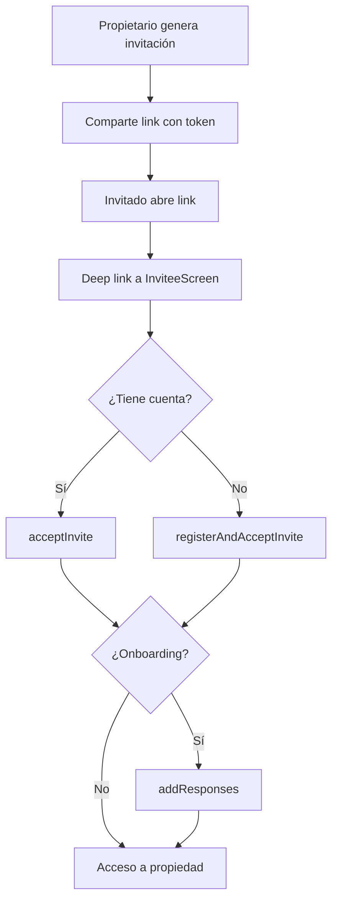

## Descripción

Ubicación: `src/modules/invitations/`

Gestiona el flujo completo de invitaciones — desde la generación por parte del propietario hasta la aceptación (con o sin registro) por parte del invitado. También maneja invitaciones a canales de chat.

## Screens

| Screen              | Ruta                        | Descripción                                             |
| ------------------- | --------------------------- | ------------------------------------------------------- |
| `InviteScreen`      | `/invite/owner/[bookingId]` | Generación y compartición de invitaciones (propietario) |
| `InviteeScreen`     | `/invite/[token]`           | Aceptación de invitación (invitado)                     |
| `ChatInviteeScreen` | `/chat/invite/[token]`      | Aceptación de invitación a canal de chat                |

## API Endpoints

<Tabs>
  <Tab title="Invitaciones de propiedad">
    | Método | Path | Descripción | |---|---|---| | `POST` | `/invitations/generate` | Generar link
    de invitación con rol asignado | | `GET` | `/invitations/validate/{token}` | Validar un token de
    invitación | | `PUT` | `/invitations/accept/{token}` | Aceptar invitación (usuario existente) |
    | `PUT` | `/invitations/register-and-accept` | Registrarse y aceptar invitación en un solo paso
    | | `PUT` | `/invitations/responses/{token}` | Enviar respuestas de onboarding post-invitación |
  </Tab>
  <Tab title="Invitaciones de chat">
    | Método | Path | Descripción | |---|---|---| | `GET` | `/chat/invitations/validate/{token}` |
    Validar invitación a canal de chat | | `PUT` | `/chat/invitations/accept/{token}` | Aceptar
    invitación a canal de chat |
  </Tab>
</Tabs>

## Hooks

| Hook                      | Descripción                                                                 |
| ------------------------- | --------------------------------------------------------------------------- |
| `useInviteGeneration()`   | Genera links de invitación con rol para una propiedad o booking específico. |
| `useInviteValidation()`   | Valida tokens de invitación y retorna los datos asociados.                  |
| `useInviteAcceptance()`   | Acepta una invitación para un usuario ya registrado.                        |
| `useInviteRegistration()` | Combina registro de cuenta y aceptación de invitación en un único flujo.    |
| `useInviteResponses()`    | Envía respuestas de onboarding post-invitación.                             |

<CodeGroup>
```typescript useInviteGeneration
const { generate, isLoading } = useInviteGeneration();

await generate({
bookingId: "booking-123",
role: "guest",
});

````

```typescript useInviteAcceptance
const { accept, isLoading } = useInviteAcceptance();

await accept({ token: "invite-token-abc" });
````

```typescript useInviteRegistration
const { registerAndAccept, isLoading } = useInviteRegistration();

await registerAndAccept({
  token: 'invite-token-abc',
  name: 'Juan',
  email: 'juan@example.com',
});
```

</CodeGroup>

## Tipos principales

```typescript
interface GenerateInviteRequest {
  bookingId: string;
  role: string;
}

interface GenerateInviteResponse {
  token: string;
  link: string;
}

interface InviteData {
  token: string;
  role: string;
  propertyName: string;
  inviterName: string;
}

interface InviteValidation {
  isValid: boolean;
  data: InviteData | null;
}

interface InviteAcceptance {
  token: string;
}

interface RegisterAndAcceptInviteRequest {
  token: string;
  name: string;
  email: string;
}

interface OnboardingQuestions {
  questions: Question[];
}

interface OnboardingResponses {
  token: string;
  responses: Record<string, string>;
}

interface ChatInviteInfo {
  channelName: string;
  inviterName: string;
}

interface ChatInviteValidation {
  isValid: boolean;
  data: ChatInviteInfo | null;
}
```

## Flujo completo de invitación

El proceso de invitación sigue estos pasos:

<Warning>
  Los tokens de invitación tienen una vigencia limitada. Si el token expira, el invitado deberá
  solicitar una nueva invitación al propietario.
</Warning>

1. **Generación** — El propietario accede a `InviteScreen` y genera una invitación con un rol específico (guest, co-owner, etc.).
2. **Compartición** — Se genera un link con token que el propietario comparte por el medio que prefiera (WhatsApp, email, etc.).
3. **Apertura** — El invitado abre el link, que a través de deep linking redirige a `InviteeScreen`.
4. **Validación** — Se valida el token automáticamente al cargar la pantalla.
5. **Aceptación** — Según el estado del invitado:
   - **Si tiene cuenta** → Se ejecuta `acceptInvite` y se le otorga acceso inmediato.
   - **Si no tiene cuenta** → Se ejecuta `registerAndAcceptInvite`, que crea la cuenta y acepta la invitación en un solo paso.
6. **Onboarding** — Opcionalmente, se presentan preguntas de onboarding post-aceptación que se envían con `addResponses`.


