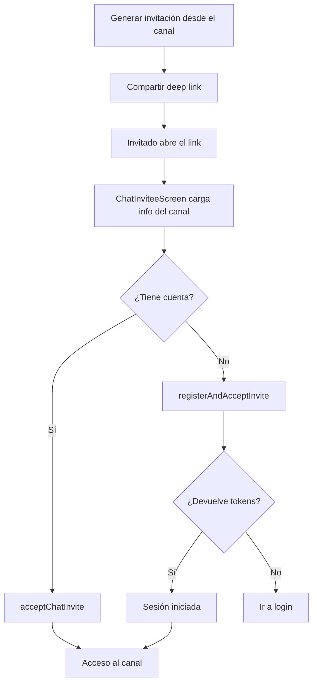

## Descripción

Ubicación: `src/modules/invitations/`

Gestiona la aceptación de invitaciones a canales de chat, con o sin registro previo del invitado.

<Note>
  Las invitaciones a una estancia se retiraron de la app: los endpoints que las sostenían
  (`/v2/invitations/generate`, `/validate/{token}`, `/add-responses/{token}` y `/{token}/metadata`)
  desaparecieron con la migración de usuarios a v2. Invitar pasa a gestionarse desde el chat.
</Note>

## Screens

| Screen              | Ruta                      | Descripción                                       |
| ------------------- | ------------------------- | ------------------------------------------------- |
| `ChatInviteeScreen` | `/chat/invite/[token]`    | Aceptación de invitación a canal de chat          |
| Onboarding de chat  | `/chat/invite/onboarding` | Registro (`name`/`email`) del invitado sin cuenta |

## API Endpoints

| Método | Path                                  | Backend | Descripción                                 |
| ------ | ------------------------------------- | ------- | ------------------------------------------- |
| `POST` | `/chat/mobile/invitations`            | tools   | Generar invitación a un canal de chat       |
| `GET`  | `/chat/mobile/invitations/{token}`    | tools   | Obtener info del canal para una invitación  |
| `PUT`  | `/v2/invitations/accept/{token}`      | api     | Aceptar invitación (usuario autenticado)    |
| `PUT`  | `/v2/invitations/register-and-accept` | api     | Registrarse y aceptar invitación en un paso |

<Note>
  La generación y la consulta de info del canal viven en el backend de tools; la aceptación la
  resuelve `vivla-api`.
</Note>

## Hooks

| Hook                      | Descripción                                                              |
| ------------------------- | ------------------------------------------------------------------------ |
| `useInviteRegistration()` | Combina registro de cuenta y aceptación de invitación en un único flujo. |

```typescript useInviteRegistration
const { registerAndAcceptInvite, isRegistering } = useInviteRegistration();

const result = await registerAndAcceptInvite({
  token: 'invite-token-abc',
  name: 'Juan',
  email: 'juan@example.com',
});
// result.hasSession indica si el alta abrió sesión automáticamente
```

## Tipos principales

```typescript
interface RegisterAndAcceptInviteRequest {
  token: string;
  email: string;
  name: string;
}

// V2 anida la sesión en `tokens` y la omite si el alta se completa pero el
// inicio de sesión automático no. El mapper la aplana en `session`, opcional.
type RegisterAndAcceptUserV2 = UserV2 & { tokens?: AuthTokensV2 };

type RegisterAndAcceptInviteResponse = User & {
  session?: {
    token: string;
    refreshToken: string;
    tokenExpiresIn: number;
  };
};

interface ChatInviteInfo {
  channelId: string;
  channelName: string;
  channelImage?: string;
  channelType: string;
  inviterName: string;
  inviterAvatar?: string;
  status: 'active' | 'expired';
}
```

## Flujo de invitación a un chat

<Warning>
  Cada invitación es de un solo uso. Si el token ya se aceptó, la API responde `code` 49; si no
  corresponde a ninguna invitación, `code` 44.
</Warning>

1. **Generación** — Desde la info del canal se genera una invitación (`/chat/mobile/invitations`) y se comparte el deep link devuelto por el backend.
2. **Apertura** — El invitado abre el link, que lleva a `ChatInviteeScreen` (`/chat/invite/{token}`).
3. **Info** — La pantalla carga los datos del canal con `/chat/mobile/invitations/{token}`.
4. **Aceptación** — Según el estado del invitado:
   - **Si tiene cuenta** → `acceptChatInvite` acepta la invitación y entra al canal.
   - **Si no tiene cuenta** → el onboarding pide nombre y email, y `registerAndAcceptInvite` crea la cuenta y acepta la invitación en una sola llamada. La contraseña es opcional: si no se envía, la API genera una y manda un email de restablecimiento.


```mermaid
flowchart TD
    A[Generar invitación desde el canal] --> B[Compartir deep link]
    B --> C[Invitado abre el link]
    C --> D[ChatInviteeScreen carga info del canal]
    D --> E{¿Tiene cuenta?}
    E -->|Sí| F[acceptChatInvite]
    E -->|No| G[registerAndAcceptInvite]
    G --> H{¿Devuelve tokens?}
    H -->|Sí| I[Sesión iniciada]
    H -->|No| J[Ir a login]
    F --> K[Acceso al canal]
    I --> K
```
