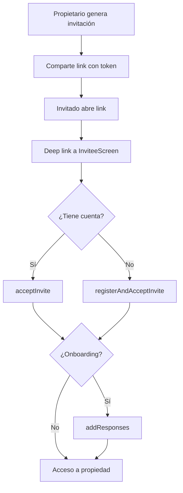

## Descripción

Ubicación: `src/modules/invitations/`

Gestiona el flujo completo de invitaciones — desde la generación por parte del propietario hasta la aceptación (con o sin registro) por parte del invitado. También maneja invitaciones a canales de chat.

## Screens

| Screen                   | Ruta                        | Descripción                                                                                    |
| ------------------------ | --------------------------- | ---------------------------------------------------------------------------------------------- |
| `InviteScreen`           | `/invite/owner/[bookingId]` | Generación y compartición de invitaciones (propietario)                                        |
| `InviteeScreen`          | `/invite/[token]`           | Aceptación de invitación (invitado)                                                            |
| `InviteOnboardingScreen` | `/invite/onboarding`        | Registro (`name`/`email`) y preguntas de onboarding (`interests`/`activities`) post-aceptación |
| `ChatInviteeScreen`      | `/chat/invite/[token]`      | Aceptación de invitación a canal de chat                                                       |

## API Endpoints

<Tabs>
  <Tab title="Invitaciones de propiedad">
    | Método | Path | Descripción | | --- | --- | --- | | `POST` | `/v2/invitations/generate` |
    Generar link de invitación con rol (`delegate` o `guest`) | | `GET` | `/v2/invitations/validate/
    {token}` | Validar un token de invitación | | `PUT` | `/v2/invitations/accept/{token}` | Aceptar
    invitación (usuario existente) | | `PUT` | `/v2/invitations/register-and-accept` | Registrarse y
    aceptar invitación en un solo paso | | `PUT` | `/v2/invitations/add-responses/{token}` | Enviar
    respuestas de onboarding post-invitación |
  </Tab>
  <Tab title="Invitaciones de chat">
    | Método | Path | Descripción | | --- | --- | --- | | `POST` | `/chat/mobile/invitations` |
    Generar invitación a un canal de chat | | `GET` | `/chat/mobile/invitations/{token}` | Obtener
    info del canal para una invitación | | `GET` | `/v2/invitations/validate/{token}` | Validar
    invitación a canal de chat | | `PUT` | `/v2/invitations/accept/{token}` | Aceptar invitación a
    canal de chat |
  </Tab>
</Tabs>

<Note>
  Las invitaciones de chat comparten los endpoints `validate`/`accept` de `/v2/invitations` con las
  de propiedad; solo la generación y la consulta de info del canal usan el backend de chat
  (`/chat/mobile/invitations`).
</Note>

## Hooks

| Hook                      | Descripción                                                                 |
| ------------------------- | --------------------------------------------------------------------------- |
| `useInviteGeneration()`   | Genera links de invitación con rol para una propiedad o booking específico. |
| `useInviteValidation()`   | Valida tokens de invitación y retorna los datos asociados.                  |
| `useInviteAcceptance()`   | Acepta una invitación para un usuario ya registrado.                        |
| `useInviteRegistration()` | Combina registro de cuenta y aceptación de invitación en un único flujo.    |
| `useInviteResponses()`    | Envía respuestas de onboarding post-invitación.                             |

<CodeGroup>
```typescript useInviteGeneration
const { generateInvite, isGenerating } = useInviteGeneration();

// bookingId (string) y role posicional ('delegate' | 'guest')
const { link } = await generateInvite('booking-123', 'guest');

````

```typescript useInviteAcceptance
const { acceptInvite } = useInviteAcceptance();

await acceptInvite('invite-token-abc');
````

```typescript useInviteRegistration
const { registerAndAcceptInvite, isRegistering } = useInviteRegistration();

const result = await registerAndAcceptInvite({
  token: 'invite-token-abc',
  name: 'Juan',
  email: 'juan@example.com',
});
// result.isNewUser indica si se creó una cuenta nueva
```

</CodeGroup>

## Tipos principales

```typescript
interface GenerateInviteRequest {
  booking: number;
  role: 'delegate' | 'guest';
}

interface GenerateInviteResponse {
  user: string;
  link: string;
  target: string;
  type: string;
  role: string;
}

// La validación devuelve el objeto completo (no un wrapper isValid/data)
interface InviteValidation {
  user: string;
  userName: string;
  token: string;
  target: string;
  type: string;
  role: string;
  createdAt: string;
  booking: Booking;
  onboardingQuestions: OnboardingQuestions;
}

interface InviteAcceptance {
  success: boolean;
}

interface RegisterAndAcceptInviteRequest {
  token: string;
  email: string;
  name: string;
}

// register-and-accept devuelve un LoginResponse (incluye isNewUser)
type RegisterAndAcceptInviteResponse = LoginResponse;

// Las preguntas de onboarding se agrupan en intereses y actividades
interface OnboardingQuestions {
  interests: Array<{ id: string; name: string }>;
  activities: Array<{ id: string; name: string }>;
}

interface QuestionAnswer {
  id: string;
  comment?: string;
}

interface OnboardingResponses {
  interests: QuestionAnswer[];
  activities: QuestionAnswer[];
}

interface ChatInviteValidation {
  token: string;
  channelId: string;
  channelName: string;
  channelImage?: string;
  channelType: string;
  inviterName: string;
  inviterAvatar?: string;
  expiresAt: string;
  type: 'chat';
  status: 'pending' | 'accepted' | 'expired';
}
```

## Flujo completo de invitación

El proceso de invitación sigue estos pasos:

<Warning>
  Los tokens de invitación tienen una vigencia limitada. Si el token expira, el invitado deberá
  solicitar una nueva invitación al propietario.
</Warning>

1. **Generación** — El propietario accede a `InviteScreen` y genera una invitación con un rol específico (`delegate` o `guest`).
2. **Compartición** — Se genera un link con token que el propietario comparte por el medio que prefiera (WhatsApp, email, etc.).
3. **Apertura** — El invitado abre el link, que a través de deep linking redirige a `InviteeScreen`.
4. **Validación** — Se valida el token automáticamente al cargar la pantalla.
5. **Aceptación** — Según el estado del invitado:
   - **Si tiene cuenta** → Se ejecuta `acceptInvite` y se le otorga acceso inmediato.
   - **Si no tiene cuenta** → Se ejecuta `registerAndAcceptInvite`, que crea la cuenta y acepta la invitación en un solo paso.
6. **Onboarding** — Opcionalmente, se presentan preguntas de onboarding post-aceptación que se envían con `addResponses`.


```mermaid
flowchart TD
    A[Propietario genera invitación] --> B[Comparte link con token]
    B --> C[Invitado abre link]
    C --> D[Deep link a InviteeScreen]
    D --> E{¿Tiene cuenta?}
    E -->|Sí| F[acceptInvite]
    E -->|No| G[registerAndAcceptInvite]
    F --> H{¿Onboarding?}
    G --> H
    H -->|Sí| I[addResponses]
    H -->|No| J[Acceso a propiedad]
    I --> J
```
